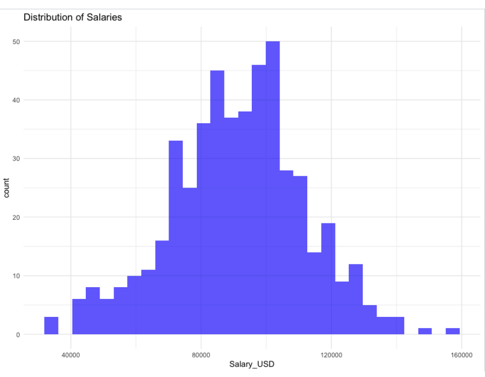
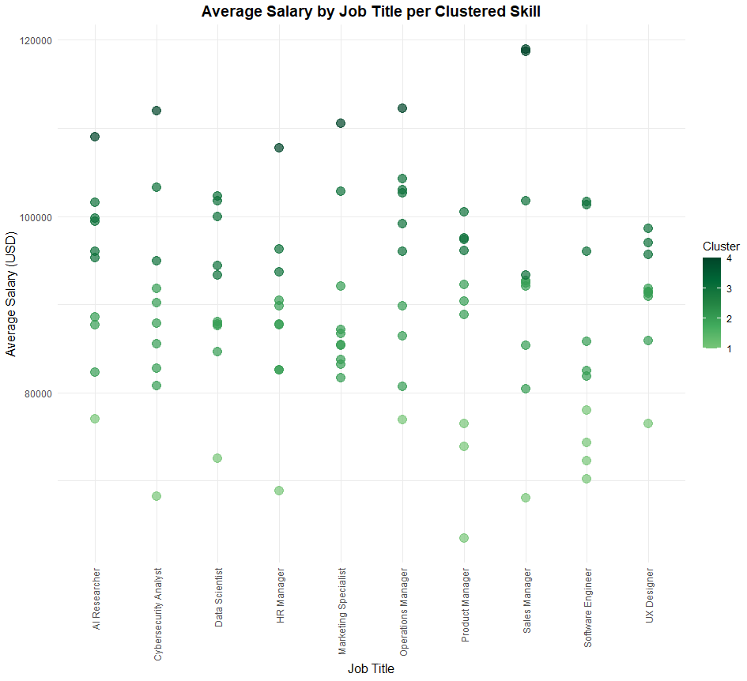
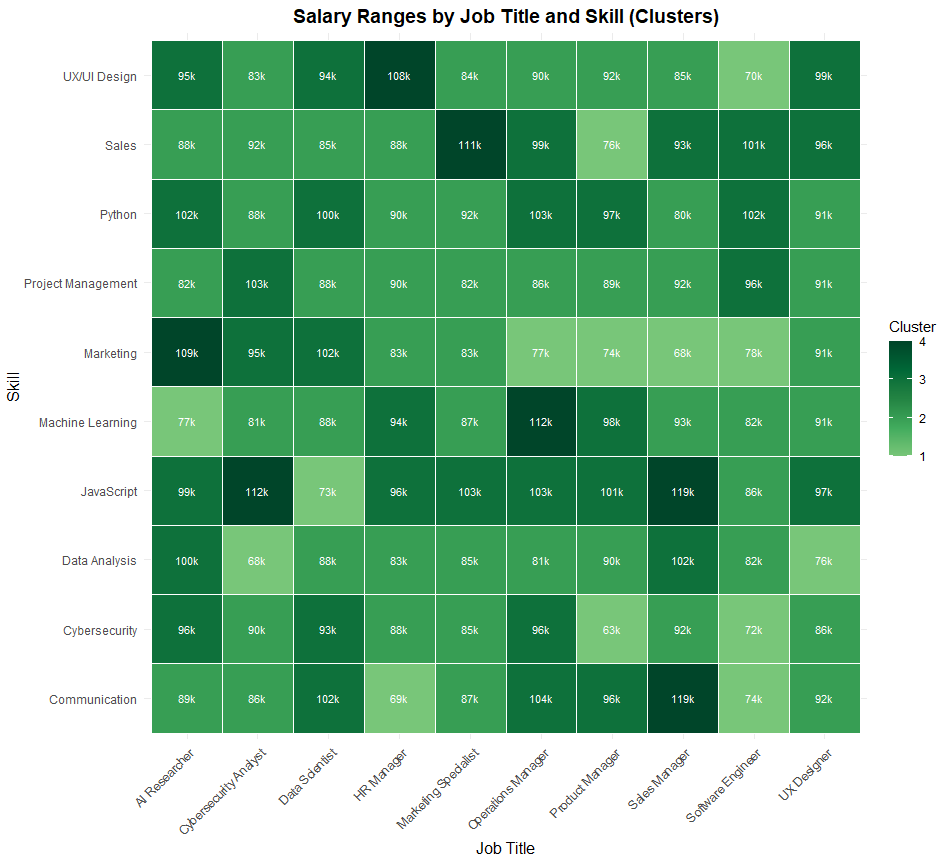

# AI Job Market Insights

## Overview
This project explores AI job market trends by analyzing salary data, job titles, required skills, and AI adoption across different industries. The goal is to uncover salary distributions, skill-set demands, and clustering patterns within AI-related job roles.

## Data
The dataset used for this analysis, `ai_job_market_insights.csv`, contains the following columns:
- **Job_Title**: The title of the job position.
- **Required_Skills**: The skills required for the position, listed as comma-separated values.
- **Salary_USD**: The annual salary in USD for the job.
- **Industry**: The industry in which the job role exists.
- **AI_Adoption_Level**: The level of AI adoption within the industry.
- **Automation_Risk**: The level of automation risk for the role.
- **Remote_Friendly**: Whether the role is remote-friendly.
- **Job_Growth_Projection**: Projected job growth for the role.

## Analysis
This project contains two scripts for analyzing and visualizing the AI job market data:

### Script 1: Data Exploration & Classification
1. **Data Preparation**: Cleans and processes the dataset by converting categorical columns to factors and removing rows with missing values.
2. **Exploratory Data Analysis (EDA)**: Visualizes salary distributions and AI adoption levels across industries.
3. **Clustering**: Performs K-means clustering on salary data to identify patterns.
4. **Classification**: Splits the data into training and testing sets and trains a Random Forest model to predict job growth projections. A Decision Tree model is also built and visualized.

### Script 2: Visualizing Salary Ranges with Gradient Clusters
1. **Data Preparation**: Cleans and expands the data by splitting skills into separate rows and calculating the average salary for each Job Title and Skill combination.
2. **K-means Clustering**: Clusters jobs by average salary using K-means and orders the clusters.
3. **Visualization**: Creates a scatter plot of job salaries per skill cluster and a heatmap showing salary ranges by job title and skill.

## Requirements
Before running the scripts, ensure you have the following packages installed:
- `dplyr`
- `tidyr`
- `ggplot2`
- `plotly`
- `caret`
- `cluster`
- `rpart`
- `randomForest`
- `RColorBrewer`
- `tidyverse`

You can install the required packages by running:
```r
install.packages(c("tidyr", "dplyr", "ggplot2", "plotly", "caret", "cluster", "rpart.plot", "randomForest"))
```
For Script 2, you can install missing packages with the following function:
```r
install_if_missing <- function(pkg){
  if(!require(pkg, character.only = TRUE)){
    install.packages(pkg, repos = "http://cran.us.r-project.org")
    library(pkg, character.only = TRUE)
  }
}
```

## Running the Scripts
1. **Load the Data**: Ensure the CSV file (`ai_job_market_insights.csv`) is in the correct directory or update the path in the script.
2. **Execute the Scripts**: Run each script in RStudio or any R environment.

### Script 1: Data Exploration & Classification
```r
source('script1.R')
```

### Script 2: Visualizing Salary Ranges with Gradient Clusters
```r
source('script2.R')
```


## Results
- **Exploratory Visualizations**: The first script generates visualizations showing salary distributions, AI adoption levels across industries, and clusters based on salary and AI adoption.
  
  
- **Clustering Insights**: The second script clusters jobs based on salary and visualizes the results in a scatter plot and heatmap.
  
- **Model Predictions**: The Random Forest model predicts job growth projections based on factors like salary, AI adoption, and automation risk. The Decision Tree model is visualized as follows:
  

## Future Work
- **Advanced Modeling**: Implement more advanced machine learning techniques to predict salaries or job growth more accurately.
- **Additional Features**: Include more granular features such as education requirements or geographic location for deeper insights into the AI job market.
- **Real-time Data**: Integrate with real-time job market APIs for up-to-date analysis.
